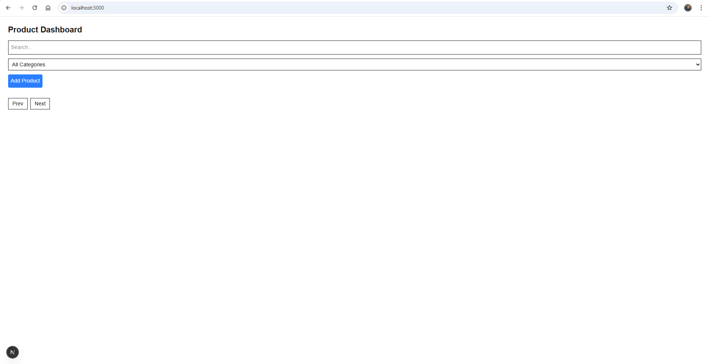
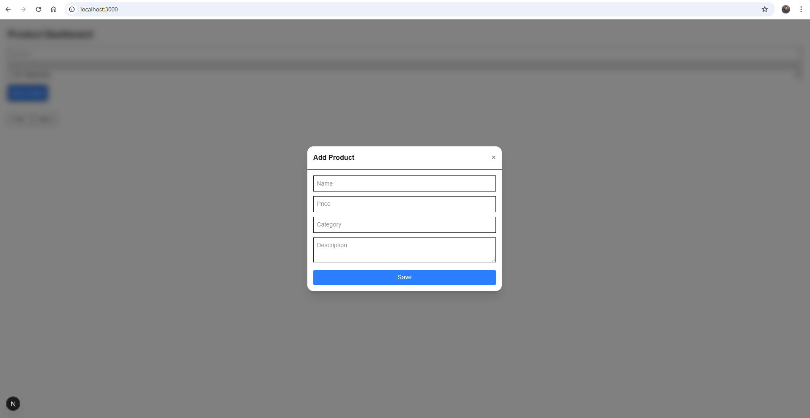
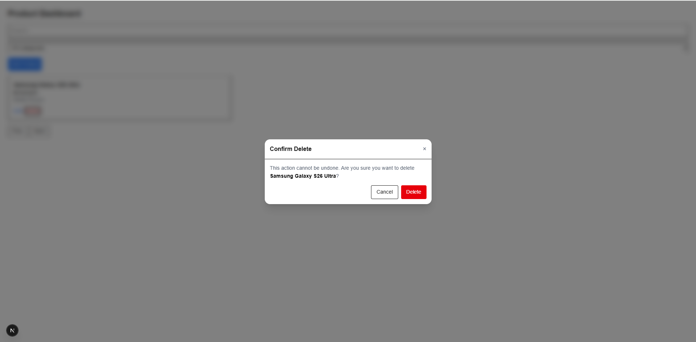
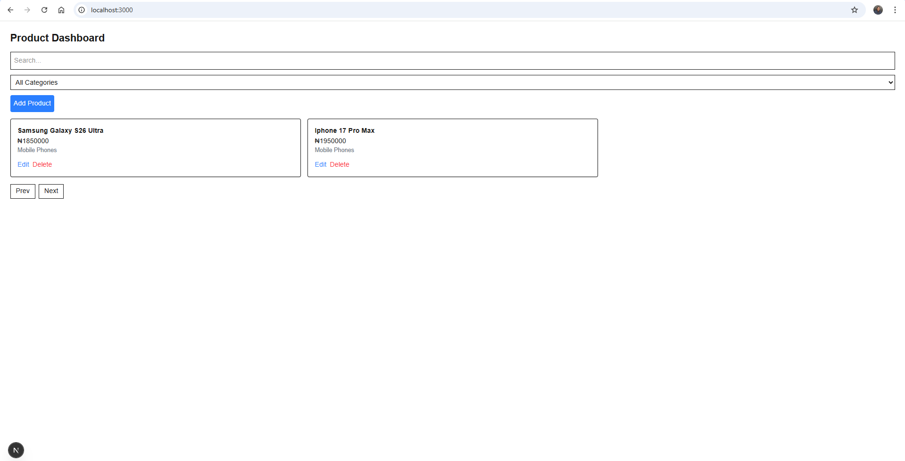

# 🛒 Product Management Dashboard

A simple and responsive Product Management Dashboard built with **Next.js**, **TypeScript**, **React Query**, and **Tailwind CSS**.  
This project allows users to manage products with full CRUD operations.

---

## 🚀 Features

- View list of products
- Search products by name
- Filter products by category
- Add new products
- Edit existing products
- Delete products (with confirmation modal)
- Pagination
- Responsive design (mobile, tablet, desktop)
- Form validation
- Loading and error states

---

## 🛠 Tech Stack

- Next.js
- TypeScript
- React Query
- Tailwind CSS
- React Hook Form
- Mock API (MockAPI.io)

---

## 📦 Setup Instructions (Step-by-Step)

Follow these steps carefully to run the project locally:

---

**1. Clone the repository**

Open your terminal and run:

```bash
git clone https://github.com/YOUR_USERNAME/my-product-dashboard.git


**2. Move into the project folder**
cd my-product-dashboard

**3. Install dependencies**

Make sure you have Node.js installed, then run:
npm install

**4. Start the development server**
npm run dev

**5. Open in browser**
After starting the server, open:

http://localhost:3000







